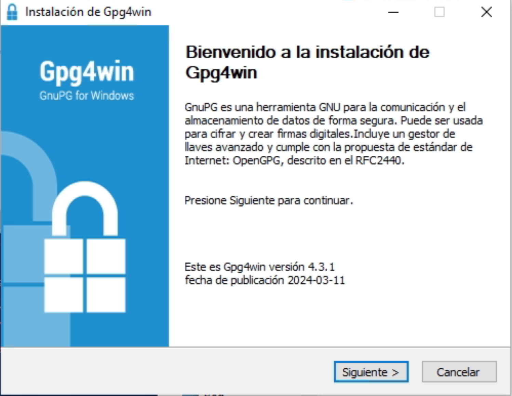

# Instalacion de MedicalOffice en windows
---
## Requisitos
- Windows 10  Compilacion Minima 19045.5608 / Windows server 2022
- Docker Desktop
- Gpg4win (se instala en el proceso)
---
## Instalacion de Docker

- Entrar a https://www.docker.com/products/docker-desktop/
---
- Seleccionar el docker necesario para su sistema

---
- Esperar a que finalice la descarga y luego darle en abrir archivo

---
- Al ejecutar nos aparecera esta la siguiente pantalla y damos clic en OK

---
- Nos aparecera la siguiente pantalla y esperemos a que finalice

---
- Al finalizar nos aparecera lo siguiente y le damos en close

---
- Buscamos el icono de la ballena de docker y lo abrimos al abrir nos aparecera esto y le damos skip

---
- skip

---
- aqui nos vamos al engrande de configuracion

---
-  En configuracion seleccionamos la casilla de iniciar cuando windows abre que aqui es la que esta deseleccionada

---
- aqui nos vamos a ir a actualizaciones de sofware y seleccionamos 
la opcion de descargar automaticamente

---
- al finalisar la demaos a Aplicar y reiniciar y listo tendremos que ver esto y ya se puede minimizar

## Ejecutamos el MedicalOffice.exe

## Instalacion de Gpg4win (IMPORTANTE)

***El instalador de Gpg4win se iniciara automaticamente si el instalador de MedicalOffice detecta que no esta isntalado en el sistema***

### Paso 1
- Siguiente

### Paso 2

### Paso 3

### Paso 4

### Paso 5

**Listo ya tienes instalado el Gpg4win**